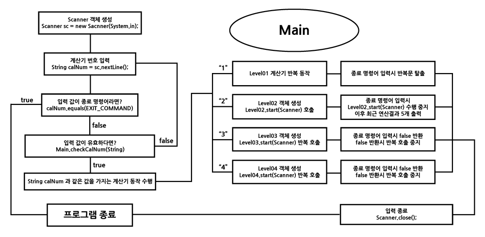
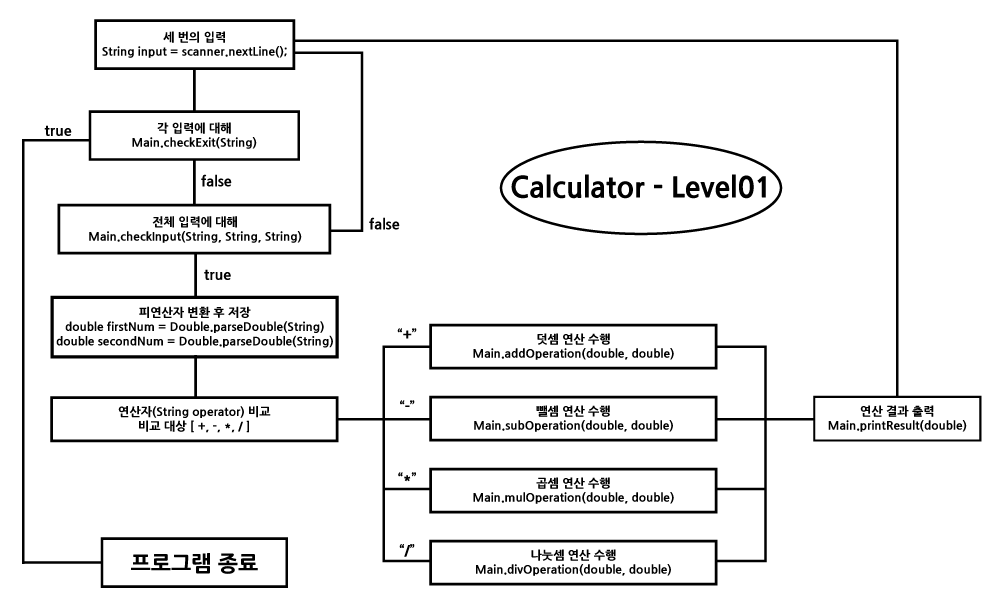
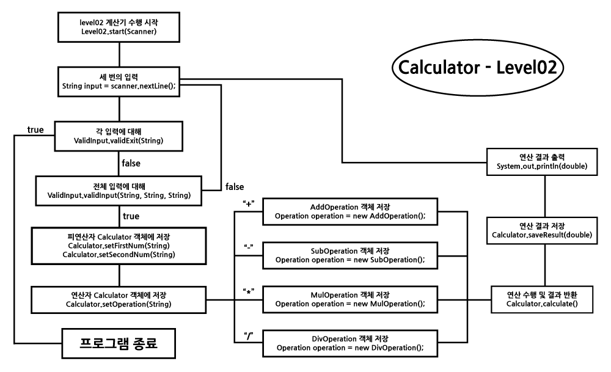
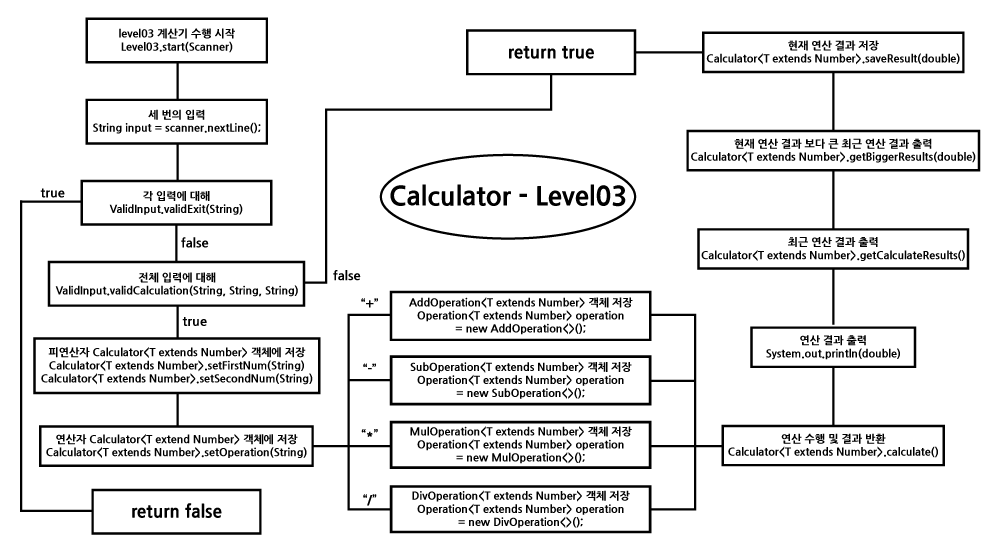

# 목차
1. [목적](#calculator)
   - [패키지 구성](#package)
2. [요구사항](#요구사항)
   - [필수 기능](#필수-기능)
     - [level01 계산기](#level01---단일-클래스main-class-구현)
     - [level02 계산기](#level02---여러-클래스의-객체를-활용한-구현)
   - [도전 기능](#도전-기능)
     - [level03 계산기](#level03---enum-generics-lambda-stream-을-활용한-구현)
3. 시스템 아키텍처
4. [구현 및 트러블 슈팅](#구현-및-트러블-슈팅)
<br/><br/><br/>

# Calculator
캠프 `CH2` 에서 학습한 `Java` 를 통해 입력받은 값을 연산하는 `계산기` 를 개발하는 `개인과제(프로젝트)`, 해당 프로젝트의 목적은 학습한 `Java` 의 실습과 `객체 지향 개념` 의 응용이다.
<br/><br/>
해당 프로젝트는 `corretto-17(version 17.0.1)` JDK 를 사용하였다.

## Package
```
src/main/java/calculator ┬─ Main.java
                         │
                         ├─ /level02 ┬─ Level02.java 
                         │           ├─ /calculate
                         │           └─ /validation
                         │
                         └─ /level03 ┬─ Level03.java
                                     ├─ /calculate
                                     ├─ /validation
                                     └─ /enums
```
- `Main.java` : `단일 클래스(Main)` 로 구현한 `level01 계산기` 로직과 `계산기 선택` 로직 작성
<br/><br/>
- `/level02` : `클래스를 활용` 해 구현한 `level02 계산기` 의 `구성 패키지 및 클래스` 위치
  - `Level02.java` : `level02 계산기` 의 작업 수행 흐름을 구현한 클래스
  - `/calculate` : `연산 역할` 의 인터페이스 및 클래스 위치
  - `/validation` : 입력 값의 `유효성` 을 검사하는 `ValidInput` 클래스 위치
<br/><br/>
- `/level03` : 도전 기능의 요구사항을 적용한 `level03 계산기` 의 `구성 패키지 및 클래스` 위치
  - `Level03.java` : `level03 계산기` 의 작업 수행 흐름을 구현한 클래스
  - `/calculate` : `연산 역할` 의 인터페이스 및 클래스 위치
  - `/validation` : 입력 값의 `유효성` 을 검사하는 `ValidInput` 클래스 위치
  - `/enums` : `level03 계산기` 에서 사용되는 `문자열 관리` 클래스 위치
<br/><br/><br/>

# 요구사항
기본적으로 `추가 클래스 주입` 의 여부로 2가지 방식의 개발을 진행해야 하는 것을 잊지말자!<br/>
구현한 기능은 해당 문서에 `체크`해서 혼동할 일이 없도록 할 것!

## 필수 기능
### Level.01 - 단일 클래스(Main class) 구현
- [x] `양의 정수` 및 `0` 입력
  - 입력 값으로 양의 정수 `2개` 를 입력 받아야 하며, 각 정수는 따로 전달 받는다.
  - 전달된 정수는 필요에 따른 타입을 갖는 변수에 저장한다.
- [x] `사칙연산 기호(+, -, *, /)` 입력
  - 입력받은 사칙연산 기호를 적절한 타입을 선택해 해당 타입을 갖는 변수에 저장한다.
- [x] 입력 받은 값을 통한 연산 수행 후 결과 출력
  - 연산오류 발생시 연산 오류에 대한 내용을 출력하는 예외처리 필요
- [x] 입력과 연산 반복 수행, 사용자가 종료를 원할 때까지
  - 사용자가 `"exit"` 를 입력하지 않는한 계속해서 계산기 기능 수행
  - `"exit"` 입력시 실행 종료(정상) 될 것

### Level.02 - 여러 클래스의 객체를 활용한 구현
- [x] 사칙연산 수행후 결과 값 반환 메서드 구현
- [x] 연산 결과를 저장하는 `Collection` 타입 필드를 가진 `Calculator` 클래스 생성
- [x] 양의 정수 2개와 연산 기호를 파라미터로 받아 사칙연산을 수행
- [x] 연산 수행 역할은 `Calculator` 클래스가 담당
  - 연산결과는 `Calculator` 필드에 존재하는 `Collection` 타입의 객체에 저장
- [x] 소스 코드 수정 후에도 수정전 기능들이 반드시 똑같이 동작해야 함
- [x] `main` 메서드에서 `Calculator` 객체의 `Collection` 필드에 직접 접근하지 못하도록 할 것
  - 메서드를 통한 접근을 구현할 것
- [x] `Calculator` 객체에 저장된 연산 결과들 중 가장 먼저 저장된 데이터를 삭제하는 기능을 가진 메서드를 구현
  - 해당 메서드가 `Main` 클래스의 `main` 메서드에 활용할 수 있도록 할 것
<br/><br/>

## 도전 기능
### Level.03 - Enum, Generics, Lambda, Stream 을 활용한 구현
- [x] `Enum` 을 활용해 연산자 타입(+, -, *, /)을 관리하고 계산기에 적용
- [x] `Generics` 를 황용해 실수 값을 전달 받아도 연산이 가능하도록 수정
  - 단순하게 타입을 변환하는 것은 안 됨!
- [x] 저장한 연산 결과를 담은 `Collection` 객체에서 입력 받은 연산의 결과보다 큰 결과 값들을 출력하는 기능 추가
  - 해당 기능을 수행하는 메서드 구현시 `Lambda` 와 `Stream` 을 활용해 구현할 것
<br/><br/><br/>

# 시스템 아키텍처
## 메인 아키텍처

<br/><br/>

## 각 계산기 아키텍처
### Level.01


### Level.02


### Level.03

<br/><br/><br/>

# 구현 및 트러블 슈팅
구현에 대한 내용과 어떤 문제점을 예상, 파악해 코드를 수정했는지에 대한 내용을 담은 포스팅 목록
- [계산기 - level.01(1)](https://development-diary-for-me.tistory.com/116)
- [계산기 - level.01(2)](https://development-diary-for-me.tistory.com/118)
- [계산기 - level.02(1)](https://development-diary-for-me.tistory.com/119)
- [계산기 - level.02(2)](https://development-diary-for-me.tistory.com/121)
- [계산기 - level.03(1)](https://development-diary-for-me.tistory.com/122)
- [계산기 - level.03(2)](https://development-diary-for-me.tistory.com/124)
- [계산기 - level.03(3)](https://development-diary-for-me.tistory.com/125)